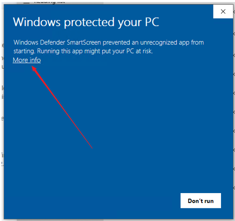
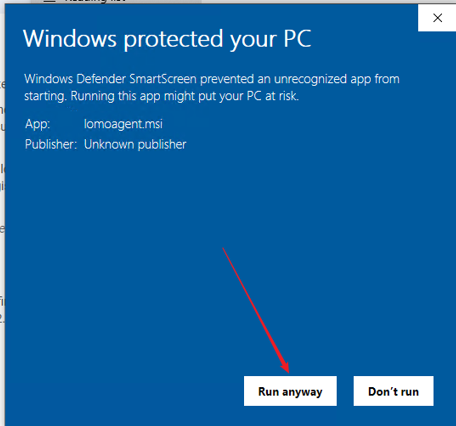
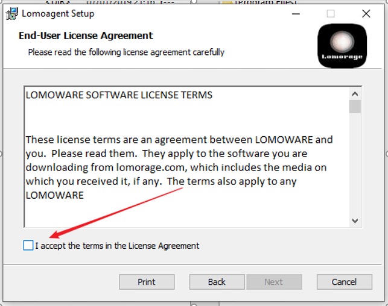
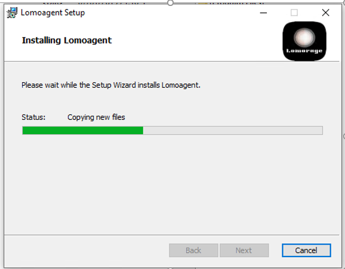
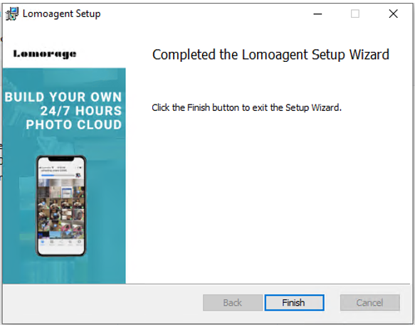
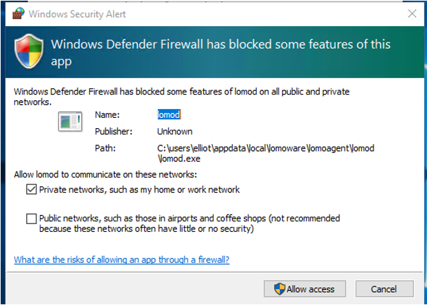
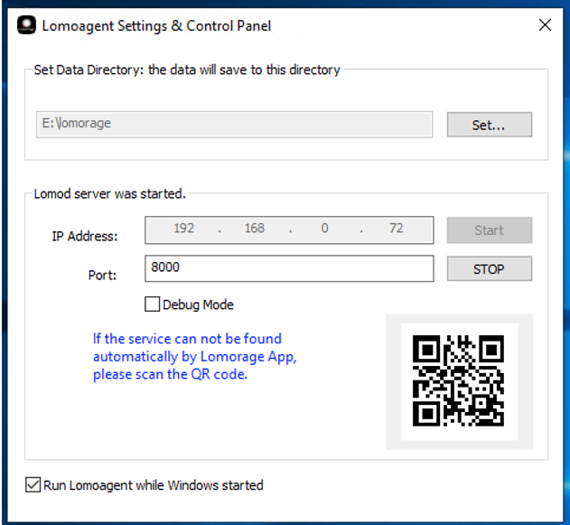

## 1. Download lomoagent.msi from lomorage.com

## 2. Double click lomoagent.msi to start the installation:
### 2.1 If meet below issue, please click More info as below picture.

**then** click Run anyway as below

## 3. Then follow the wizzard to finish the installation
in the End-User License Agreement, please checked the box as below:

## 4.Start lomoagent
Now you should see the lomoagent icon on your desktop, you can double click to start the lomoagent.

If you meet below dialog popuped up by the Windows os, please select "Private ..." one and click the Allow access.

## 5. Config lomoagent

You will see below picture while you start the lomoagent:

### 5.1 Config the Data directory:
This directory is to save the photos and videos uploading from your phone.

### 5.2 IP
You can use the Lomorage APP on phone to scan the QR code or manually input this lomoagent IP.

Enjoy Lomorage, no worry about your photos any more.
