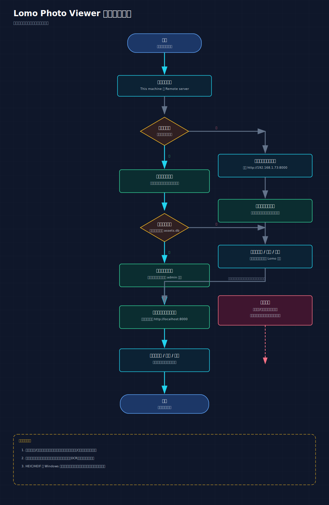

本文档面向最终用户，介绍 **Lomo Photo Viewer** 在 Windows 桌面上的安装、首次配置、登录方式、常用操作和注意事项。

如果你还没有安装程序，请先参考 [INSTALL.md](../INSTALL.md)。

## 1. 产品简介

Lomo Photo Viewer 是一个 Windows 桌面照片浏览器，桌面外壳由 Tauri 提供，界面采用 Immich Web 前端，底层连接 Lomo 后端。

它支持两种使用方式：

- **本机模式（This machine）**：照片库保存在当前电脑上，程序会自动启动内置的 `lomod`，默认服务地址是 `http://localhost:8000`。
- **远程模式（Remote server）**：桌面程序不在本机建库，而是连接到你网络中的现有 Lomo 服务。

## 2. 安装与启动

### 2.1 推荐安装方式

在 PowerShell 中运行：

```powershell
irm https://github.com/lomorage/LomoAgentWin/releases/latest/download/install.ps1 | iex
```

这条命令会自动下载最新版本、静默安装并在完成后启动程序。

### 2.2 手动安装

你也可以从 GitHub Release 页面手动下载安装包：

- `LomoPhotoViewer_*_x64-setup.exe`
- `LomoPhotoViewer_*_x64_en-US.msi`

详细步骤见 [INSTALL.md](../INSTALL.md)。

## 3. 首次使用

首次启动时，登录页会先让你选择照片存储方式。

### 3.1 选择存储方式

你会看到两个入口：

- **This machine**
  说明照片存放在当前电脑，本程序会使用随安装包附带的 `lomod`。
- **Remote server**
  说明照片库已经存在于另一台机器或服务器，本程序仅负责连接和浏览。

你以后仍然可以在 **Lomo Settings** 中切换模式，但要注意：

- 切换模式**不会迁移数据**
- 修改本地文件夹**不会自动搬运已有照片**
- 保存设置后通常需要**重新登录**

### 3.2 本机模式：创建新的本地照片库

如果你选择 **This machine**，首次流程通常如下：

1. 选择一个照片根目录
2. 程序会把管理员库放在该目录下的 `admin` 子目录中
3. 设置管理员密码
4. 点击 **Create library**
5. 完成后使用刚刚创建的账号登录

建议：

- 选择一个**空目录**作为新的本地库根目录
- 密码至少使用 `8` 位，并混合字母和数字
- 如果计划长期使用，尽量把照片根目录放在空间充足、路径稳定的位置

### 3.3 本机模式：打开已有本地库

如果你选择的文件夹中已经存在本地库数据，界面会提示该目录包含已有库，并给出继续方式。

这时你有两个选择：

- **Choose another folder**：改选一个空目录，创建新的本地库
- **Continue to sign in / Open existing library**：直接打开该已有库，并使用那个库里原有的账号登录

适用场景：

- 你已经在这台电脑上用过 Lomo
- 你迁移过本地照片目录，但希望继续使用原来的账号和库数据

### 3.4 远程模式：连接现有 Lomo 服务

如果你选择 **Remote server**，登录页会要求你填写：

- **Server address**
- **Port**

常见示例：

- `192.168.1.73` + `8000`
- `lomo.example.com` + `8000`

如果你在 **Lomo Settings** 页面中直接填写完整地址，则通常采用这种形式：

```text
http://192.168.1.73:8000
```

使用远程模式时：

- 本程序不会在本机创建新的管理员库
- 你需要使用远程 Lomo 服务中**已经存在的账号**
- 本地电脑主要承担界面浏览和播放，不承担建库职责

## 4. 登录说明

### 4.1 本机模式登录

本机模式下，登录目标固定为：

```text
http://localhost:8000
```

首次建库完成后，请使用你刚刚创建的管理员账号登录。

### 4.2 远程模式登录

远程模式下，登录目标是你填写的远程服务器地址。

请确认：

- 服务器地址可从当前电脑访问
- 端口已开放
- 远程 `lomod` 正在运行
- 用户名和密码正确

### 4.3 登录表单注意事项

当前界面中登录字段看起来像 Email，但它会被当作 **Lomo 用户名** 使用。

如果无法登录，优先检查：

1. 用户名是否正确
2. 密码是否正确
3. 连接的是否是正确的后端地址

## 5. 主界面与日常浏览

登录成功后，你主要会通过时间轴和缩略图来浏览照片与视频。

### 5.1 时间轴浏览

应用会按月份组织资源，默认从较新的月份开始显示。

你可以：

- 按月滚动浏览
- 点击缩略图进入查看器
- 在相册上下文中按该相册内的月份浏览内容

### 5.2 查看原图与视频

支持的日常查看行为包括：

- 查看图片缩略图
- 打开原图
- 播放视频

对于 `HEIC` 或 `HEIF` 文件，Windows 上首次缩略图生成可能比普通 `JPG` 稍慢，这是因为程序会走兼容解码路径。

### 5.3 收藏

你可以把照片标记为收藏。

收藏状态会直接写回 Lomo 后端，因此：

- 收藏列表和普通时间轴看到的是同一份状态
- 在相册中对照片加星，也会反映到全局收藏状态

## 6. 相册操作

当前版本支持基本相册管理：

- 创建相册
- 修改相册名称和描述
- 删除相册
- 向相册中添加照片
- 从相册中移除照片

适合的使用方式：

- 用相册整理旅行、活动或项目素材
- 先从时间轴筛选，再批量加入相册

## 7. Lomo Settings 设置页

登录后，可以从账号菜单进入 **Lomo Settings** 页面。

这个页面主要用于：

- 切换 **Bundled Local** 和 **Remote Server**
- 设置本地照片目录
- 设置远程 Lomo 服务地址

### 7.1 本地设置

在 **Local Backend Configuration** 中：

- 可以修改本地照片根目录
- 程序会把默认管理员库放到该目录下的 `admin` 子目录
- 仅保存本地配置，不代表已经切换为本机模式

### 7.2 远程设置

在 **Remote Backend Configuration** 中：

- 输入远程 Lomo 服务的基础地址
- 例如：`http://192.168.1.73:8000`
- 仅保存远程配置，不代表已经切换为远程模式

### 7.3 保存设置后的行为

请特别注意：

- 切换后端模式后，程序通常会要求你重新登录
- 切换模式**不会自动迁移照片数据**
- 修改本地文件夹**不会自动移动原有照片**

如果你的当前账号没有管理员权限，可能无法访问这个页面。

## 8. 数据与配置位置

### 8.1 配置文件

桌面版配置文件通常位于：

```text
C:\Users\<用户名>\AppData\Roaming\com.lomoware.photoviewer\config.json
```

### 8.2 默认本地照片目录

如果你没有手动指定目录，本机模式默认会使用：

```text
C:\Users\<用户名>\AppData\Roaming\com.lomoware.photoviewer\photos
```

### 8.3 管理员目录

本机模式创建新库时，管理员相关目录通常位于：

```text
<你的照片根目录>\admin
```

## 9. 当前版本支持范围

### 9.1 已支持

- 本机模式与远程模式切换
- 首次创建本地照片库
- 打开已有本地库
- 用户登录与注销
- 时间轴浏览
- 查看原图和视频
- 收藏
- 基本相册管理

### 9.2 当前未覆盖或能力受限

以下功能在当前版本中未启用，或者界面存在但不会提供完整能力：

- 搜索
- 智能搜索
- 地图
- 人脸识别
- OCR
- 分享链接
- 回收站

如果你在界面中看到相关入口为空、不可用或没有结果，这通常不是使用错误，而是当前版本尚未对接这些能力。

## 10. 常见问题

### 10.1 选择文件夹后提示已有本地库数据

原因：

- 该目录中已经包含 `assets.db` 或现有本地库数据

处理方式：

- 想新建库：改选空目录
- 想继续使用旧库：选择 **Open existing library** 或 **Continue to sign in**

### 10.2 切换本地目录后，照片没有自动搬过去

这是当前设计行为。

修改本地目录只会更新配置并重启本地后端，不会自动迁移已有数据。若要迁移，请自行备份并整理文件目录。

### 10.3 切换后端模式后被要求重新登录

这是正常现象。

因为本机模式和远程模式对应的是两套不同的后端目标，切换后需要重新对新的目标进行身份验证。

### 10.4 远程服务器连不上

请检查：

1. 地址是否正确
2. 端口是否正确
3. 是否写了 `http://`
4. 远程主机是否能从当前电脑访问
5. 防火墙是否放行对应端口

### 10.5 HEIC 缩略图显示慢

这通常发生在 Windows 环境下，属于兼容解码路径带来的正常现象。首次处理会比 `JPG` 更慢，但并不代表文件损坏。

## 11. 推荐上手路径

如果你是第一次使用，建议按下面顺序操作：

1. 先按 [INSTALL.md](../INSTALL.md) 完成安装
2. 启动程序后选择 **This machine**
3. 选一个空目录作为照片根目录
4. 创建管理员密码并完成建库
5. 登录后先熟悉时间轴浏览
6. 再尝试收藏和相册整理
7. 如果以后要连接 NAS 或云端 Lomo，再到 **Lomo Settings** 中切换为 **Remote Server**

---

如需补充截图版说明、面向普通用户的精简版手册，或管理员部署版说明，可以在此文档基础上继续扩展。
